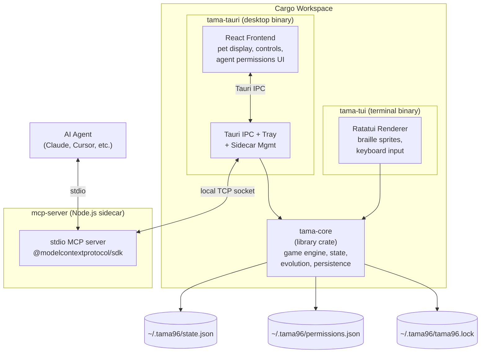
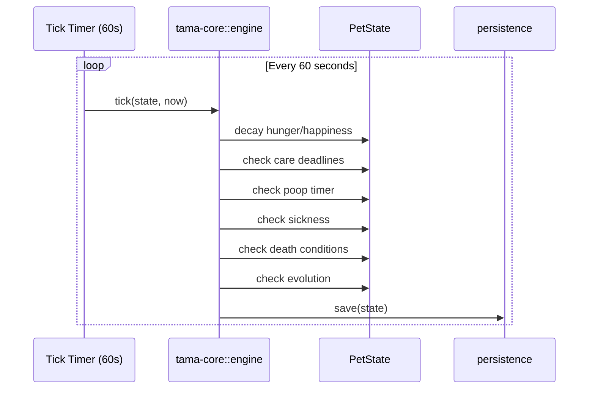
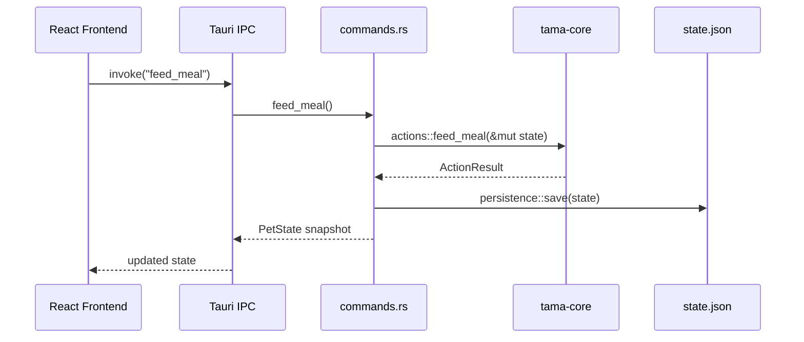
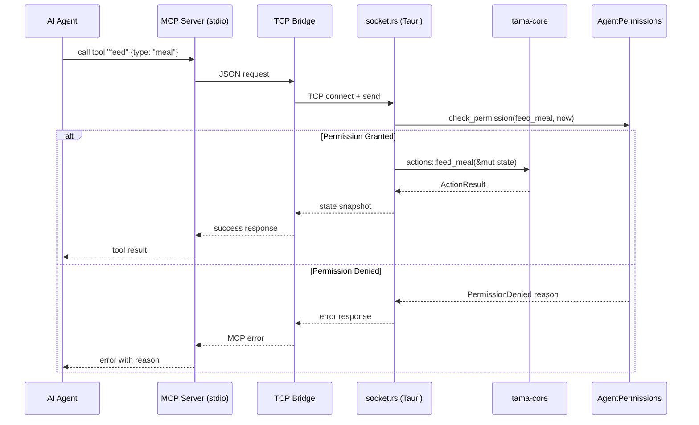

# Design Document: tama96

## Overview

tama96 is a faithful recreation of the original 1996 Tamagotchi P1 virtual pet, delivered as both a cross-platform desktop app (Tauri v2 with React frontend) and a terminal app (ratatui TUI). A shared Rust game engine (`tama-core`) implements the complete P1 lifecycle — egg through death — with real-time clock simulation where 1 real day = 1 pet year. The pet persists across app restarts via JSON state files with elapsed-time catch-up on load.

A bundled MCP server (Node.js sidecar, stdio transport) exposes the pet to AI agents. A human-configurable permission layer gates every agent action with per-action allow/deny toggles and rate limits, ensuring the human owner retains full control over how agents interact with their pet.

The system enforces single-instance access via lockfile — only one frontend (Tauri or TUI) may own the pet at a time. The Tauri app persists in the system tray when the window is closed, continuing to tick the game engine in the background.

## Architecture



## Sequence Diagrams

### Main Tick Loop



### User Action Flow (Tauri)



### MCP Agent Action Flow



## Components and Interfaces

### Component 1: tama-core (Shared Library Crate)

**Purpose**: Pure game logic with zero UI or I/O dependencies. All state mutations happen here.

**Modules**:
- `state` — Data structures for pet state, agent permissions, enums
- `engine` — Tick loop, heart decay, care/discipline mistake timers
- `evolution` — Stage transitions, branching matrix
- `actions` — All player/agent actions (feed, play, discipline, etc.)
- `characters` — Per-character constants (sleep times, decay rates, lifespans)
- `persistence` — Save/load JSON, lockfile, elapsed-time catch-up

**Responsibilities**:
- Own all game rules and state transitions
- Enforce P1-faithful mechanics
- Provide deterministic state mutations (given state + action + timestamp → new state)
- Handle persistence and single-instance locking

### Component 2: tama-tauri (Desktop Binary)

**Purpose**: Tauri v2 host process — system tray, background tick loop, IPC bridge, sidecar management.

**Responsibilities**:
- Run background tick loop via tokio task
- Expose tama-core actions as Tauri IPC commands
- Manage system tray (icon, tooltip, menu)
- Spawn and monitor MCP sidecar process
- Host local TCP socket for MCP bridge communication
- Send desktop notifications on critical pet events

### Component 3: React Frontend

**Purpose**: Pixel-art desktop UI rendered in Tauri webview.

**Responsibilities**:
- Render pet sprites with animation states
- Display meters (hunger, happiness, discipline, weight, age)
- Provide action buttons matching original P1 icon layout
- Host agent permission settings panel
- Poll backend state via Tauri IPC

### Component 4: tama-tui (Terminal Binary)

**Purpose**: Full-featured terminal frontend using ratatui.

**Responsibilities**:
- Render pet sprites as braille characters (32×16 pixels → ~16×4 terminal cells)
- Display meters using unicode hearts and gauge widgets
- Handle keyboard input mapped to game actions
- Run its own tick loop (shares tama-core, same state file)
- Enforce lockfile exclusion with Tauri

### Component 5: mcp-server (Node.js Sidecar)

**Purpose**: Expose pet to AI agents via MCP protocol over stdio transport.

**Responsibilities**:
- Register MCP tools (feed, play_game, discipline, give_medicine, clean_poop, toggle_lights, get_status)
- Register MCP resources (pet://status, pet://evolution-chart, pet://permissions)
- Bridge to Rust backend via local TCP socket
- Return permission-denied errors with human-readable reasons

## Data Models

### PetState

```rust
use chrono::{DateTime, Utc};
use serde::{Deserialize, Serialize};

#[derive(Debug, Clone, Serialize, Deserialize, PartialEq)]
pub enum LifeStage {
    Egg,
    Baby,
    Child,
    Teen,
    Adult,
    Special,
    Dead,
}

#[derive(Debug, Clone, Serialize, Deserialize, PartialEq)]
pub enum Character {
    // Baby
    Babytchi,
    // Child
    Marutchi,
    // Teen
    Tamatchi,
    Kuchitamatchi,
    // Adult
    Mametchi,
    Ginjirotchi,
    Maskutchi,
    Kuchipatchi,
    Nyorotchi,
    Tarakotchi,
    // Special
    Oyajitchi,
}

#[derive(Debug, Clone, Copy, Serialize, Deserialize, PartialEq)]
pub enum TeenType {
    Type1, // 0–2 discipline mistakes during child stage
    Type2, // 3+ discipline mistakes during child stage
}

#[derive(Debug, Clone, Serialize, Deserialize)]
pub struct PetState {
    // Identity
    pub stage: LifeStage,
    pub character: Character,
    pub teen_type: Option<TeenType>,

    // Meters (hunger/happiness: 0–4, discipline: 0–100)
    pub hunger: u8,
    pub happiness: u8,
    pub discipline: u8,
    pub weight: u8,
    pub age: u16, // in years (1 year = 1 real day)

    // Mistake tracking (cumulative across child + teen)
    pub care_mistakes: u8,
    pub discipline_mistakes: u8,

    // Status flags
    pub poop_count: u8,
    pub is_sick: bool,
    pub sick_dose_count: u8, // doses administered, 2 to cure
    pub is_sleeping: bool,
    pub is_alive: bool,
    pub lights_on: bool,

    // Timers (DateTime<Utc>)
    pub last_tick: DateTime<Utc>,
    pub birth_time: DateTime<Utc>,
    pub stage_start_time: DateTime<Utc>,
    pub last_poop_time: DateTime<Utc>,

    // Pending deadlines (None = no pending event)
    pub pending_care_deadline: Option<DateTime<Utc>>,
    pub pending_discipline_deadline: Option<DateTime<Utc>>,
    pub pending_lights_deadline: Option<DateTime<Utc>>,

    // Snack overfeeding tracker (for sickness risk)
    pub snack_count_since_last_tick: u8,
}
```

**Validation Rules**:
- `hunger` ∈ [0, 4]
- `happiness` ∈ [0, 4]
- `discipline` ∈ [0, 100], increments in steps of 25
- `weight` ≥ 1 (minimum weight)
- `poop_count` ∈ [0, 4] (sickness triggered at threshold)
- `stage` must be consistent with `character` (e.g., `Babytchi` only valid when `stage == Baby`)
- `teen_type` is `Some` only when `stage ∈ {Teen, Adult, Special}`

### AgentPermissions

```rust
use std::collections::HashMap;

#[derive(Debug, Clone, Serialize, Deserialize, PartialEq, Eq, Hash)]
pub enum ActionType {
    FeedMeal,
    FeedSnack,
    PlayGame,
    Discipline,
    GiveMedicine,
    CleanPoop,
    ToggleLights,
    GetStatus,
}

#[derive(Debug, Clone, Serialize, Deserialize)]
pub struct ActionPermission {
    pub allowed: bool,
    pub max_per_hour: Option<u32>,
}

#[derive(Debug, Clone, Serialize, Deserialize)]
pub struct ActionLogEntry {
    pub action: ActionType,
    pub timestamp: DateTime<Utc>,
}

#[derive(Debug, Clone, Serialize, Deserialize)]
pub struct AgentPermissions {
    pub enabled: bool, // master kill switch
    pub allowed_actions: HashMap<ActionType, ActionPermission>,
    pub action_log: Vec<ActionLogEntry>,
}
```

**Validation Rules**:
- `max_per_hour` when `Some`, must be ≥ 1
- `action_log` entries older than 1 hour can be pruned on each check
- When `enabled == false`, all actions are denied regardless of per-action settings

### CharacterStats

```rust
pub struct CharacterStats {
    pub sleep_hour: u8,        // hour pet falls asleep (24h)
    pub wake_hour: u8,         // hour pet wakes up (24h)
    pub hunger_decay_minutes: u16, // minutes between hunger heart loss
    pub happy_decay_minutes: u16,  // minutes between happiness heart loss
    pub base_weight: u8,
    pub max_lifespan_days: u16,
    pub poop_interval_minutes: u16,
}
```

### Character Constants Table

```rust
impl CharacterStats {
    pub fn for_character(c: &Character) -> Self {
        match c {
            Character::Babytchi => CharacterStats {
                sleep_hour: 20, wake_hour: 8,
                hunger_decay_minutes: 30, happy_decay_minutes: 30,
                base_weight: 5, max_lifespan_days: 0, // evolves before lifespan matters
                poop_interval_minutes: 60,
            },
            Character::Marutchi => CharacterStats {
                sleep_hour: 20, wake_hour: 9,
                hunger_decay_minutes: 20, happy_decay_minutes: 25,
                base_weight: 10, max_lifespan_days: 0,
                poop_interval_minutes: 45,
            },
            Character::Tamatchi => CharacterStats {
                sleep_hour: 21, wake_hour: 9,
                hunger_decay_minutes: 18, happy_decay_minutes: 22,
                base_weight: 15, max_lifespan_days: 0,
                poop_interval_minutes: 40,
            },
            Character::Kuchitamatchi => CharacterStats {
                sleep_hour: 21, wake_hour: 9,
                hunger_decay_minutes: 16, happy_decay_minutes: 20,
                base_weight: 20, max_lifespan_days: 0,
                poop_interval_minutes: 35,
            },
            Character::Mametchi => CharacterStats {
                sleep_hour: 22, wake_hour: 9,
                hunger_decay_minutes: 12, happy_decay_minutes: 15,
                base_weight: 10, max_lifespan_days: 16,
                poop_interval_minutes: 30,
            },
            Character::Ginjirotchi => CharacterStats {
                sleep_hour: 22, wake_hour: 9,
                hunger_decay_minutes: 14, happy_decay_minutes: 17,
                base_weight: 15, max_lifespan_days: 12,
                poop_interval_minutes: 35,
            },
            Character::Maskutchi => CharacterStats {
                sleep_hour: 22, wake_hour: 9,
                hunger_decay_minutes: 10, happy_decay_minutes: 12,
                base_weight: 20, max_lifespan_days: 16,
                poop_interval_minutes: 25,
            },
            Character::Kuchipatchi => CharacterStats {
                sleep_hour: 21, wake_hour: 9,
                hunger_decay_minutes: 8, happy_decay_minutes: 10,
                base_weight: 25, max_lifespan_days: 6,
                poop_interval_minutes: 20,
            },
            Character::Nyorotchi => CharacterStats {
                sleep_hour: 21, wake_hour: 9,
                hunger_decay_minutes: 6, happy_decay_minutes: 7,
                base_weight: 15, max_lifespan_days: 3,
                poop_interval_minutes: 20,
            },
            Character::Tarakotchi => CharacterStats {
                sleep_hour: 21, wake_hour: 9,
                hunger_decay_minutes: 7, happy_decay_minutes: 8,
                base_weight: 20, max_lifespan_days: 4,
                poop_interval_minutes: 20,
            },
            Character::Oyajitchi => CharacterStats {
                sleep_hour: 22, wake_hour: 9,
                hunger_decay_minutes: 10, happy_decay_minutes: 12,
                base_weight: 20, max_lifespan_days: 16,
                poop_interval_minutes: 25,
            },
        }
    }
}
```

## Algorithmic Pseudocode

### Core Tick Algorithm

```rust
/// Core tick function — called every ~60 seconds by the host process.
/// Advances the pet simulation by the elapsed time since last_tick.
///
/// PRECONDITIONS:
///   - state.is_alive == true
///   - now >= state.last_tick
///
/// POSTCONDITIONS:
///   - state.last_tick == now
///   - All meter decrements applied proportional to elapsed time
///   - Care/discipline deadlines checked and mistakes incremented if expired
///   - Evolution checked and applied if conditions met
///   - Death checked and state.is_alive set to false if conditions met
///
/// LOOP INVARIANT (for catch-up ticks):
///   - After processing tick i, state reflects exactly i minutes of elapsed simulation
pub fn tick(state: &mut PetState, now: DateTime<Utc>) {
    if !state.is_alive || state.stage == LifeStage::Egg {
        // Egg uses stage_start_time for hatch check only
        check_egg_hatch(state, now);
        state.last_tick = now;
        return;
    }

    if state.is_sleeping {
        check_wake(state, now);
        state.last_tick = now;
        return; // No decay during sleep
    }

    let stats = CharacterStats::for_character(&state.character);
    let elapsed = (now - state.last_tick).num_minutes() as u16;

    // 1. Heart decay
    decay_hearts(state, &stats, elapsed);

    // 2. Care deadline management
    check_care_deadlines(state, now);

    // 3. Poop accumulation
    check_poop(state, &stats, now);

    // 4. Sickness checks
    check_sickness(state);

    // 5. Discipline call generation (random false attention calls)
    maybe_generate_discipline_call(state, now);
    check_discipline_deadline(state, now);

    // 6. Sleep time check
    check_sleep(state, &stats, now);

    // 7. Death conditions
    check_death(state, &stats, now);

    // 8. Evolution
    check_evolution(state, now);

    // 9. Age increment (on wake, handled in check_wake)
    state.last_tick = now;
}
```

### Heart Decay Algorithm

```rust
/// Decrement hunger and happiness hearts based on elapsed time and character decay rates.
///
/// PRECONDITIONS:
///   - elapsed >= 0
///   - stats contains valid decay rates for current character
///
/// POSTCONDITIONS:
///   - state.hunger decremented by floor(elapsed / hunger_decay_minutes), clamped to 0
///   - state.happiness decremented by floor(elapsed / happy_decay_minutes), clamped to 0
///   - If hunger or happiness reaches 0, pending_care_deadline is set (if not already)
fn decay_hearts(state: &mut PetState, stats: &CharacterStats, elapsed_minutes: u16) {
    let hunger_lost = elapsed_minutes / stats.hunger_decay_minutes;
    let happy_lost = elapsed_minutes / stats.happy_decay_minutes;

    state.hunger = state.hunger.saturating_sub(hunger_lost as u8);
    state.happiness = state.happiness.saturating_sub(happy_lost as u8);

    // Start care deadline if a meter just hit 0
    if (state.hunger == 0 || state.happiness == 0) && state.pending_care_deadline.is_none() {
        state.pending_care_deadline = Some(state.last_tick + chrono::Duration::minutes(15));
    }
}
```

### Evolution Algorithm

```rust
/// Check and apply evolution if the pet has reached the threshold for its current stage.
///
/// PRECONDITIONS:
///   - state.is_alive == true
///   - state.stage ∈ {Egg, Baby, Child, Teen, Adult}
///
/// POSTCONDITIONS:
///   - If evolution conditions met: stage advanced, character updated, discipline reset
///   - If no evolution: state unchanged
///   - Returns true if evolution occurred
///
/// EVOLUTION RULES:
///   Egg → Baby:     after 5 minutes
///   Baby → Child:   after 65 minutes
///   Child → Teen:   at age 3 (3 days), branch on care_mistakes
///   Teen → Adult:   at age 6 (6 days), branch on care + discipline mistakes + teen_type
///   Adult → Special: Maskutchi (from Tamatchi T2) after 4 additional days
pub fn check_evolution(state: &mut PetState, now: DateTime<Utc>) -> bool {
    let elapsed_in_stage = (now - state.stage_start_time).num_minutes();

    match state.stage {
        LifeStage::Egg => {
            if elapsed_in_stage >= 5 {
                evolve_to(state, LifeStage::Baby, Character::Babytchi, now);
                return true;
            }
        }
        LifeStage::Baby => {
            if elapsed_in_stage >= 65 {
                evolve_to(state, LifeStage::Child, Character::Marutchi, now);
                return true;
            }
        }
        LifeStage::Child => {
            if state.age >= 3 {
                let (teen_char, teen_type) = resolve_teen(state.care_mistakes, state.discipline_mistakes);
                state.teen_type = Some(teen_type);
                evolve_to(state, LifeStage::Teen, teen_char, now);
                return true;
            }
        }
        LifeStage::Teen => {
            if state.age >= 6 {
                let adult_char = resolve_adult(
                    &state.character,
                    state.teen_type.unwrap_or(TeenType::Type1),
                    state.care_mistakes,
                    state.discipline_mistakes,
                );
                evolve_to(state, LifeStage::Adult, adult_char, now);
                return true;
            }
        }
        LifeStage::Adult => {
            // Special evolution: Maskutchi from Tamatchi T2 path → Oyajitchi after 4 days
            if state.character == Character::Maskutchi
                && state.teen_type == Some(TeenType::Type2)
                && elapsed_in_stage >= 4 * 24 * 60
            {
                evolve_to(state, LifeStage::Special, Character::Oyajitchi, now);
                return true;
            }
        }
        _ => {}
    }
    false
}

/// Resolve teen character from cumulative mistakes during child stage.
///
/// POSTCONDITIONS:
///   - care_mistakes 0–2 → Tamatchi; 3+ → Kuchitamatchi
///   - discipline_mistakes 0–2 → Type1; 3+ → Type2
fn resolve_teen(care_mistakes: u8, discipline_mistakes: u8) -> (Character, TeenType) {
    let character = if care_mistakes <= 2 {
        Character::Tamatchi
    } else {
        Character::Kuchitamatchi
    };
    let teen_type = if discipline_mistakes <= 2 {
        TeenType::Type1
    } else {
        TeenType::Type2
    };
    (character, teen_type)
}

/// Resolve adult character from teen character, teen type, and cumulative mistakes.
///
/// Full P1 evolution matrix:
///   Tamatchi T1 + 0–2 care + 0 disc   → Mametchi
///   Tamatchi T1 + 0–2 care + 1 disc   → Ginjirotchi
///   Tamatchi T1 + 0–2 care + 2+ disc  → Maskutchi
///   Tamatchi T2 + 0–3 care + 2+ disc  → Maskutchi
///   Tamatchi T1/Kuchi T1 + 3+ care + 0–1 disc → Kuchipatchi
///   3+ care + moderate disc            → Nyorotchi
///   3+ care + 4+ disc                  → Tarakotchi
fn resolve_adult(
    teen_char: &Character,
    teen_type: TeenType,
    care_mistakes: u8,
    discipline_mistakes: u8,
) -> Character {
    match (teen_char, teen_type) {
        (Character::Tamatchi, TeenType::Type1) => {
            if care_mistakes <= 2 {
                match discipline_mistakes {
                    0 => Character::Mametchi,
                    1 => Character::Ginjirotchi,
                    _ => Character::Maskutchi,
                }
            } else {
                match discipline_mistakes {
                    0..=1 => Character::Kuchipatchi,
                    2..=3 => Character::Nyorotchi,
                    _ => Character::Tarakotchi,
                }
            }
        }
        (Character::Tamatchi, TeenType::Type2) => {
            if care_mistakes <= 3 && discipline_mistakes >= 2 {
                Character::Maskutchi
            } else if care_mistakes >= 3 {
                match discipline_mistakes {
                    0..=1 => Character::Kuchipatchi,
                    2..=3 => Character::Nyorotchi,
                    _ => Character::Tarakotchi,
                }
            } else {
                Character::Nyorotchi // fallback
            }
        }
        (Character::Kuchitamatchi, TeenType::Type1) => {
            match discipline_mistakes {
                0..=1 => Character::Kuchipatchi,
                2..=3 => Character::Nyorotchi,
                _ => Character::Tarakotchi,
            }
        }
        (Character::Kuchitamatchi, TeenType::Type2) => {
            match discipline_mistakes {
                0..=1 => Character::Kuchipatchi,
                2..=3 => Character::Nyorotchi,
                _ => Character::Tarakotchi,
            }
        }
        _ => Character::Nyorotchi, // safety fallback
    }
}

fn evolve_to(state: &mut PetState, stage: LifeStage, character: Character, now: DateTime<Utc>) {
    state.stage = stage;
    state.character = character;
    state.stage_start_time = now;
    state.discipline = 0; // reset on evolution
    state.pending_care_deadline = None;
    state.pending_discipline_deadline = None;
}
```

### Death Check Algorithm

```rust
/// Check all death conditions.
///
/// PRECONDITIONS:
///   - state.is_alive == true
///
/// POSTCONDITIONS:
///   - If any death condition met: state.is_alive = false, state.stage = Dead
///
/// DEATH CONDITIONS:
///   1. Old age: age >= character's max_lifespan_days
///   2. Neglect: hunger == 0 AND happiness == 0 for > 12 consecutive hours
///   3. Sickness: is_sick for > 24 hours without medicine
///   4. Snack overfeeding (baby only): snack_count > 5 in rapid succession
fn check_death(state: &mut PetState, stats: &CharacterStats, now: DateTime<Utc>) {
    // Old age
    if stats.max_lifespan_days > 0 && state.age >= stats.max_lifespan_days {
        kill(state);
        return;
    }

    // Neglect — sustained empty meters
    if state.hunger == 0 && state.happiness == 0 {
        if let Some(deadline) = state.pending_care_deadline {
            let neglect_hours = (now - deadline).num_hours();
            if neglect_hours >= 12 {
                kill(state);
                return;
            }
        }
    }

    // Untreated sickness
    if state.is_sick {
        // Track sickness start via pending_care_deadline as proxy
        // In production, add a dedicated sick_since field
    }
}

fn kill(state: &mut PetState) {
    state.is_alive = false;
    state.stage = LifeStage::Dead;
}
```

## Key Functions with Formal Specifications

### actions::feed_meal

```rust
pub fn feed_meal(state: &mut PetState) -> Result<ActionResult, ActionError>
```

**Preconditions:**
- `state.is_alive == true`
- `state.is_sleeping == false`
- `state.is_sick == false`

**Postconditions:**
- `state.hunger = min(old_hunger + 1, 4)`
- `state.weight = old_weight + 1`
- If `old_hunger == 0` and `pending_care_deadline.is_some()`: deadline cleared
- Returns `ActionResult::Fed`

### actions::feed_snack

```rust
pub fn feed_snack(state: &mut PetState) -> Result<ActionResult, ActionError>
```

**Preconditions:**
- `state.is_alive == true`
- `state.is_sleeping == false`

**Postconditions:**
- `state.happiness = min(old_happiness + 1, 4)`
- `state.weight = old_weight + 2`
- `state.snack_count_since_last_tick += 1`
- If `snack_count_since_last_tick > 3` in baby stage: `state.is_sick = true`
- Returns `ActionResult::Snacked`

### actions::play_game

```rust
pub fn play_game(state: &mut PetState, moves: [Choice; 5]) -> Result<GameResult, ActionError>
```

**Preconditions:**
- `state.is_alive == true`
- `state.is_sleeping == false`
- `state.is_sick == false`
- `moves.len() == 5`

**Postconditions:**
- Pet generates 5 random choices; player wins round if `moves[i] == pet_choice[i]`
- `wins = count of matching rounds`
- If `wins >= 3`: `state.happiness = min(old_happiness + 1, 4)`
- `state.weight = max(old_weight - 1, 1)` (always lose weight from playing)
- Returns `GameResult { rounds, wins, happiness_gained }`

**Loop Invariant:**
- After round `i`: `wins_so_far = count of matches in moves[0..=i]`

### actions::discipline

```rust
pub fn discipline(state: &mut PetState) -> Result<ActionResult, ActionError>
```

**Preconditions:**
- `state.is_alive == true`
- `state.pending_discipline_deadline.is_some()` (false attention call is active)

**Postconditions:**
- `state.discipline = min(old_discipline + 25, 100)`
- `state.pending_discipline_deadline = None`
- Returns `ActionResult::Disciplined`
- If no pending call: returns `ActionError::NoDisciplineCallPending`

### actions::give_medicine

```rust
pub fn give_medicine(state: &mut PetState) -> Result<ActionResult, ActionError>
```

**Preconditions:**
- `state.is_alive == true`
- `state.is_sick == true`

**Postconditions:**
- `state.sick_dose_count += 1`
- If `sick_dose_count >= 2`: `state.is_sick = false`, `state.sick_dose_count = 0`
- Returns `ActionResult::MedicineGiven`

### actions::clean_poop

```rust
pub fn clean_poop(state: &mut PetState) -> Result<ActionResult, ActionError>
```

**Preconditions:**
- `state.is_alive == true`
- `state.poop_count > 0`

**Postconditions:**
- `state.poop_count = old_poop_count - 1`
- Returns `ActionResult::Cleaned`

### actions::toggle_lights

```rust
pub fn toggle_lights(state: &mut PetState, now: DateTime<Utc>) -> Result<ActionResult, ActionError>
```

**Preconditions:**
- `state.is_alive == true`

**Postconditions:**
- `state.lights_on = !old_lights_on`
- If turning lights off for sleep and `pending_lights_deadline.is_some()`: deadline cleared (no care mistake)
- If turning lights off and pet should be sleeping: `state.is_sleeping = true`
- Returns `ActionResult::LightsToggled`

### persistence::save / persistence::load

```rust
pub fn save(state: &PetState, path: &Path) -> Result<(), PersistError>
pub fn load(path: &Path, now: DateTime<Utc>) -> Result<PetState, PersistError>
```

**save Preconditions:**
- `path` is writable

**save Postconditions:**
- File at `path` contains valid JSON serialization of `state`
- File write is atomic (write to temp file, then rename)

**load Preconditions:**
- File at `path` exists and contains valid JSON

**load Postconditions:**
- Returns deserialized `PetState`
- Catch-up applied: `tick()` called repeatedly for each elapsed minute since `state.last_tick`
- `returned_state.last_tick == now`

**load Loop Invariant (catch-up):**
- After simulating minute `i`: state reflects exactly `i` minutes of elapsed time since saved `last_tick`

### persistence::acquire_lock / persistence::release_lock

```rust
pub fn acquire_lock(path: &Path) -> Result<LockGuard, LockError>
pub fn release_lock(guard: LockGuard) -> Result<(), LockError>
```

**acquire_lock Preconditions:**
- `path` is writable

**acquire_lock Postconditions:**
- If no other process holds the lock: lock file created, `LockGuard` returned
- If another process holds the lock: returns `LockError::AlreadyLocked`
- Lock file contains PID of owning process

**release_lock Postconditions:**
- Lock file removed
- Other processes can now acquire

### permissions::check_permission

```rust
pub fn check_permission(
    permissions: &AgentPermissions,
    action: ActionType,
    now: DateTime<Utc>,
) -> Result<(), PermissionDenied>
```

**Preconditions:**
- `permissions` is loaded and valid

**Postconditions:**
- If `permissions.enabled == false`: returns `Err(PermissionDenied::MasterDisabled)`
- If `action` not in `allowed_actions` or `allowed == false`: returns `Err(PermissionDenied::ActionDisabled(action))`
- If `max_per_hour.is_some()` and count of `action` in `action_log` within last hour >= limit: returns `Err(PermissionDenied::RateLimited { action, limit, used })`
- Otherwise: returns `Ok(())`

## Example Usage

### Rust — Core Engine Usage

```rust
use tama_core::{state::PetState, engine, actions, persistence};
use chrono::Utc;

fn main() {
    // Load or create pet
    let save_path = dirs::home_dir().unwrap().join(".tama96/state.json");
    let lock_path = dirs::home_dir().unwrap().join(".tama96/tama96.lock");

    let _lock = persistence::acquire_lock(&lock_path).expect("Another instance is running");

    let mut state = if save_path.exists() {
        persistence::load(&save_path, Utc::now()).unwrap()
    } else {
        PetState::new_egg(Utc::now())
    };

    // Simulate a tick
    engine::tick(&mut state, Utc::now());

    // Feed the pet
    if let Ok(result) = actions::feed_meal(&mut state) {
        println!("Fed! Hunger: {}/4", state.hunger);
    }

    // Save
    persistence::save(&state, &save_path).unwrap();
}
```

### TypeScript — Tauri IPC Commands

```typescript
// usePetState.ts — React hook bridging to Rust backend
import { invoke } from "@tauri-apps/api/core";

interface PetState {
  stage: string;
  character: string;
  hunger: number;
  happiness: number;
  discipline: number;
  weight: number;
  age: number;
  poop_count: number;
  is_sick: boolean;
  is_sleeping: boolean;
  is_alive: boolean;
}

export function usePetState() {
  const [state, setState] = useState<PetState | null>(null);

  const refresh = async () => {
    const s = await invoke<PetState>("get_state");
    setState(s);
  };

  const feedMeal = () => invoke("feed_meal").then(refresh);
  const feedSnack = () => invoke("feed_snack").then(refresh);
  const playGame = (moves: string[]) => invoke("play_game", { moves }).then(refresh);
  const discipline = () => invoke("discipline").then(refresh);
  const giveMedicine = () => invoke("give_medicine").then(refresh);
  const cleanPoop = () => invoke("clean_poop").then(refresh);
  const toggleLights = () => invoke("toggle_lights").then(refresh);

  useEffect(() => {
    refresh();
    const interval = setInterval(refresh, 1000); // poll every second for UI freshness
    return () => clearInterval(interval);
  }, []);

  return { state, feedMeal, feedSnack, playGame, discipline, giveMedicine, cleanPoop, toggleLights };
}
```

### TypeScript — MCP Server Tool Registration

```typescript
// tools.ts — MCP tool definitions
import { McpServer } from "@modelcontextprotocol/sdk/server/mcp.js";
import { z } from "zod";
import { bridge } from "./bridge.js";

export function registerTools(server: McpServer) {
  server.tool("feed", { type: z.enum(["meal", "snack"]) }, async ({ type }) => {
    const result = await bridge.send({ action: "feed", params: { type } });
    return { content: [{ type: "text", text: JSON.stringify(result) }] };
  });

  server.tool("play_game", { moves: z.array(z.enum(["left", "right"])).length(5) }, async ({ moves }) => {
    const result = await bridge.send({ action: "play_game", params: { moves } });
    return { content: [{ type: "text", text: JSON.stringify(result) }] };
  });

  server.tool("discipline", {}, async () => {
    const result = await bridge.send({ action: "discipline" });
    return { content: [{ type: "text", text: JSON.stringify(result) }] };
  });

  server.tool("get_status", {}, async () => {
    const result = await bridge.send({ action: "get_status" });
    return { content: [{ type: "text", text: JSON.stringify(result) }] };
  });
}
```

## Correctness Properties

*A property is a characteristic or behavior that should hold true across all valid executions of a system — essentially, a formal statement about what the system should do. Properties serve as the bridge between human-readable specifications and machine-verifiable correctness guarantees.*

### Property 1: State invariants (meter bounds)

*For any* PetState produced by any sequence of actions and ticks, hunger must be in [0, 4], happiness in [0, 4], discipline in [0, 100] and a multiple of 25, weight ≥ 1, and poop_count in [0, 4].

**Validates: Requirements 1.1, 1.2, 1.3, 1.4, 1.5**

### Property 2: Stage-character consistency

*For any* PetState, the Character variant must be valid for the current Life_Stage (e.g., Babytchi only when stage is Baby), and teen_type must be Some only when stage is Teen, Adult, or Special.

**Validates: Requirements 1.6, 1.7**

### Property 3: Heart decay correctness

*For any* awake, alive Pet with a known Character and elapsed time, a Tick shall decrement hunger by floor(elapsed / hunger_decay_minutes) and happiness by floor(elapsed / happy_decay_minutes), each clamped to 0.

**Validates: Requirements 2.1, 2.2**

### Property 4: Care deadline lifecycle

*For any* Pet where hunger or happiness reaches 0, a 15-minute care deadline is created if none exists. *For any* Pet with an expired care deadline, care_mistakes increments by 1.

**Validates: Requirements 2.3, 2.4**

### Property 5: Sleep immunity

*For any* sleeping Pet, a Tick shall not change hunger or happiness values.

**Validates: Requirement 2.6**

### Property 6: Dead pets don't tick

*For any* dead Pet (is_alive == false), a Tick shall leave the entire PetState unchanged.

**Validates: Requirement 2.7**

### Property 7: Feed meal correctness

*For any* alive, awake, non-sick Pet, feeding a meal shall set hunger to min(old_hunger + 1, 4) and weight to old_weight + 1.

**Validates: Requirements 3.1, 3.11**

### Property 8: Feed snack correctness

*For any* alive, awake Pet, feeding a snack shall set happiness to min(old_happiness + 1, 4) and weight to old_weight + 2.

**Validates: Requirement 3.2**

### Property 9: Game outcome correctness

*For any* game with 5 moves, if the player wins 3 or more rounds then happiness increases by 1 (capped at 4), and weight always decreases by 1 (floored at 1) regardless of outcome.

**Validates: Requirements 3.4, 3.5**

### Property 10: Discipline action correctness

*For any* Pet with a pending discipline call, disciplining shall increase discipline by 25 (capped at 100) and clear the deadline. *For any* Pet without a pending call, disciplining shall return NoDisciplineCallPending error.

**Validates: Requirements 3.6, 3.7**

### Property 11: Medicine curing

*For any* sick Pet, administering medicine twice (sick_dose_count reaching 2) shall set is_sick to false and reset sick_dose_count to 0.

**Validates: Requirement 3.8**

### Property 12: Action precondition enforcement

*For any* dead Pet and any action, the Engine shall return PetIsDead error. *For any* sleeping Pet, feed_meal and play_game shall return an error.

**Validates: Requirements 3.12, 3.13**

### Property 13: Evolution determinism

*For any* two calls to the adult resolution function with identical (teen_character, teen_type, care_mistakes, discipline_mistakes), the resulting adult Character shall be identical. The full P1 branching matrix is a pure function of these inputs.

**Validates: Requirements 4.3, 4.4, 4.7**

### Property 14: Evolution reset postconditions

*For any* evolution event, discipline shall be reset to 0 and pending care and discipline deadlines shall be cleared.

**Validates: Requirement 4.6**

### Property 15: Persistence round-trip

*For any* valid PetState, serializing to JSON then deserializing shall produce an equivalent PetState.

**Validates: Requirements 6.1, 6.2, 6.5**

### Property 16: Catch-up convergence

*For any* saved PetState and any elapsed time since last_tick, loading with catch-up shall result in last_tick equal to the current timestamp.

**Validates: Requirements 6.3, 6.4**

### Property 17: Lockfile mutual exclusion

*For any* sequence of acquire/release operations, at most one process holds the Lockfile at any time.

**Validates: Requirement 7.4**

### Property 18: Permission gating

*For any* action type, when the Permission_System master switch is disabled, check_permission shall return MasterDisabled. *For any* individually disabled action, check_permission shall return PermissionDenied with the action name.

**Validates: Requirements 8.1, 8.2**

### Property 19: Rate limiting

*For any* action with a max_per_hour rate limit, if the action_log contains n ≥ max_per_hour entries for that action within the last hour, the next check_permission call shall return RateLimited.

**Validates: Requirement 8.3**

### Property 20: Death from old age

*For any* Character with a max_lifespan_days > 0, when the Pet's age reaches that value, the Engine shall set is_alive to false and stage to Dead.

**Validates: Requirement 5.1**

## Error Handling

### Error: Lockfile Already Held

**Condition**: Another tama96 process (Tauri or TUI) is already running
**Response**: Display message "Another tama96 instance is running. Only one can be active at a time."
**Recovery**: User closes the other instance, then retries

### Error: Corrupt Save File

**Condition**: `state.json` exists but fails JSON deserialization
**Response**: Log warning, back up corrupt file as `state.json.corrupt`, create fresh egg state
**Recovery**: Automatic — user starts with a new pet, old file preserved for manual inspection

### Error: MCP Sidecar Crash

**Condition**: MCP server process exits unexpectedly
**Response**: Tauri detects exit via sidecar handle, logs error, waits 2 seconds, respawns
**Recovery**: Automatic restart with exponential backoff (2s, 4s, 8s, max 30s)

### Error: Permission Denied (Agent)

**Condition**: Agent attempts action that is disabled or rate-limited
**Response**: MCP server returns structured error with human-readable reason string
**Recovery**: Agent reads `pet://permissions` resource to understand constraints and adjust strategy

### Error: Action on Dead Pet

**Condition**: Any action attempted when `state.is_alive == false`
**Response**: Return `ActionError::PetIsDead`
**Recovery**: UI shows death screen with "Hatch New Egg" option

### Error: Clock Skew / Backwards Jump

**Condition**: `now < state.last_tick` (system clock moved backwards)
**Response**: Skip tick, log warning, set `last_tick = now` to resync
**Recovery**: Automatic — next tick proceeds normally from new time baseline

## Testing Strategy

### Unit Testing Approach

- Test each action function in isolation with known input states
- Test tick function with controlled time advancement
- Test evolution matrix exhaustively — one test per evolution path (all 6 adults + special)
- Test permission checking with all combinations of enabled/disabled/rate-limited
- Test serialization round-trip for PetState and AgentPermissions
- Target: 100% coverage of tama-core

### Property-Based Testing Approach

**Property Test Library**: `proptest` (Rust)

Key properties to test with random inputs:
- Meter bounds are never violated after any sequence of actions
- Weight never drops below 1
- Evolution is deterministic for same inputs
- Catch-up produces same result regardless of tick granularity (1 big catch-up vs many small ticks)
- Permission check is consistent (same inputs → same result)

### Integration Testing Approach

- Tauri IPC round-trip: invoke command → verify state change → verify UI receives update
- MCP tool call → TCP bridge → Rust action → state change → response
- Lockfile: start Tauri, attempt TUI start, verify rejection
- Sidecar lifecycle: kill MCP process, verify Tauri restarts it
- Full lifecycle: egg → baby → child → teen → adult → death, verifying each transition

## Performance Considerations

- Tick loop runs every 60 seconds — negligible CPU. Catch-up on load may process thousands of ticks; batch by computing total elapsed hearts lost rather than iterating minute-by-minute for large gaps.
- State file is small (~2KB JSON). Atomic write (temp + rename) prevents corruption on crash.
- TCP socket between Tauri and MCP sidecar is localhost-only, sub-millisecond latency.
- React UI polls at 1Hz — sufficient for a pet that changes state every few minutes.
- Braille sprite rendering in TUI is a fixed 32×16 grid — trivial computation per frame.

## Security Considerations

- MCP server listens on stdio only (no network socket). Agent access is scoped to the single stdio connection.
- TCP bridge between Tauri and MCP sidecar binds to `127.0.0.1` with a random port. Not accessible from network.
- Permission system is defense-in-depth: even if an agent bypasses MCP, the Rust backend enforces permissions.
- Save files stored in user home directory with default permissions. No sensitive data beyond pet state.
- Sidecar binary is bundled and signed as part of the Tauri app bundle — no arbitrary code execution.

## Dependencies

### Rust (tama-core)
- `serde` + `serde_json` — serialization
- `chrono` — date/time handling
- `rand` — random number generation (game, discipline calls)

### Rust (tama-tauri)
- `tauri` v2 — app framework
- `tauri-plugin-notification` — desktop notifications
- `tauri-plugin-shell` — sidecar management
- `tokio` — async runtime for tick loop and TCP socket

### Rust (tama-tui)
- `ratatui` — terminal UI framework
- `crossterm` — terminal backend
- `dirs` — home directory resolution

### Node.js (mcp-server)
- `@modelcontextprotocol/sdk` — MCP protocol implementation
- `zod` — schema validation for tool parameters

### Frontend (React)
- `react` + `react-dom` — UI framework
- `@tauri-apps/api` — Tauri IPC bridge
- `vite` — build tool
